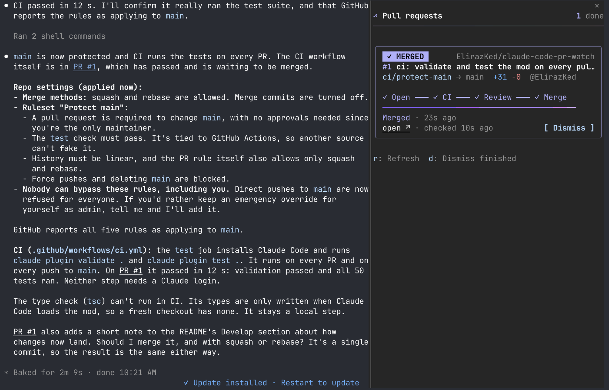

# pr-watch

A [Claude Code mod](https://code.claude.com/docs/en/plugins/mods/overview) that keeps a live pane of the GitHub pull requests a session touches: CI, review, conflicts, merge. You see when the PR Claude opened goes green, gets a review or hits a conflict, without asking.



*The pane in a real session, docked beside the conversation: this repo's first PR, a minute after it merged. While CI runs, a card looks like this:*

```
╭──────────────────────────────────────────────╮
│  ● CI RUNNING                       acme/app │
│ #12 Retry uploads with exponential backoff   │
│ feat/retry → main  +120 −14  @octocat        │
│                                              │
│ ✓ Open ━━━━━━ ⠹ CI ┈┈┈┈┈┈ ○ Review ┈┈ ○ Merge │
│ ━━━━━━━━━━━━━━━━━━━━━━━━━━━━━━━━━━━━━━━ 1/3  │
│ Running build · 1 queued · 1/3 passed        │
│ open ↗ · checked just now                 ✕  │
╰──────────────────────────────────────────────╯
```

## Install

Needs Claude Code **2.1.287 or later** and the [GitHub CLI](https://cli.github.com) logged in (`gh auth login`).

```
/plugin install pr-watch --marketplace ElirazKed/claude-code-pr-watch
```

Answer `y` to add the marketplace and press Enter for user scope. It's active at once, with no restart. Or in two steps:

```
/plugin marketplace add ElirazKed/claude-code-pr-watch
/plugin install pr-watch@claude-code-pr-watch
```

## What it watches

- **Automatically:** PRs Claude acts on: opens (`gh pr create`), pushes to (`git push` to a branch with a PR), comments on, reviews, merges or follows CI for (`gh pr checks`), through `gh` or GitHub MCP write tools. Only open PRs are picked up; a merged or closed one never gets a card, and one you stopped watching stays stopped.
- **When you ask:** `/pr-watch <url>`, or paste a PR link in a prompt. These are watched in any state.
- **When offered:** PRs Claude only reads (`gh pr view`/`diff`, a fetched link, a GitHub MCP read). Claude asks once, and only if the PR looks like your own work rather than background reading.

`/pr-watch` opens the pane, and `/pr-watch stop <number|url|all>` stops watching. Finished PRs stay until you dismiss them, `d` dismisses them all, and `r` refreshes.

Each card shows the state that matters most first: merge conflicts, then failing or running CI (naming the checks), then review, then whether GitHub will let it merge. A toast appears when the state changes, and the status line follows the focused PR.

## Merging

A card offers a merge button once GitHub would merge the PR now (open, not a draft, no conflicts, required checks and reviews done) and your account can write to the repo. The method is your default on GitHub if the repo allows it, otherwise the first the repo allows of squash, rebase and merge, and the button says which: **Squash & merge**, **Rebase & merge** or **Merge**. When the repo allows more than one, a small `⇄ rebase` button beside it switches.

- **Confirmation:** the first press asks, e.g. *Squash-merge #12 into main?*, and only **Confirm** (`y`) runs anything; **Cancel** (`n`) goes back.
- **Auto-merge:** while the PR waits on checks or reviews in a repo with auto-merge allowed, the button is **Auto-merge · squash** instead. It asks the same way, then GitHub merges the PR once everything passes (`gh pr merge --auto`). With auto-merge on, the card says so (*Auto-merge on · squash*) and has a **Cancel auto-merge** button, which needs no confirmation.
- **Which account:** `gh pr merge` runs as the gh account that can see the repo, the one the poller reads it with.
- **When GitHub says no:** its message shows on the card. If it refused the method itself (say, a ruleset that allows only rebase), that method isn't offered for the repo again this session.

## How it polls

Every session on the machine shares **one** poller, so 30 sessions watching 30 PRs cost about one GitHub call every 20–60 seconds, not 30.

- Each session lists its PRs in `~/.cache/pr-watch/sessions/`. The file's modified time is its heartbeat.
- When the shared results are due, one session takes a short lease and fetches every live session's PRs in one batched GraphQL query (40 per query). It writes them to `~/.cache/pr-watch/results.json`, and the other sessions read that.
- By default it polls every 20s while CI is running somewhere and every 60s otherwise. It backs off when fewer than 300 calls of your rate limit remain.

### Poll intervals

Both intervals are settings in `/config`:

| Setting | Default | Range |
|---|---|---|
| `poll_active_seconds`: while a watched PR's CI runs or it's about to merge | 20 | 10–600 |
| `poll_idle_seconds`: while nothing is moving | 60 | 10–3600 |

A change applies from the next round, with no reload needed. Sessions check on a 10s tick, so an interval is rounded up to the next tick. The session that runs a round uses its own settings, so keep them the same across Claude Code configs that share the machine.
- With several `gh` accounts logged in, a PR the active account can't see is retried with the others. The cache remembers which **login** sees which owner, never a token.

## Develop

```
claude --plugin-dir .                # load it from this folder for one session
claude plugin validate .             # what it hooks and calls, and anything the engine would refuse
claude plugin test .                 # the *.test.ts suites
```

`tsc -p .` type-checks once Claude Code has loaded the mod, which writes `.claude-plugin/types/`.

`main` is protected: changes land through a pull request, once the `test` check (validate + tests, in `.github/workflows/ci.yml`) passes. History stays linear, so merge with squash or rebase; merge commits are turned off.
